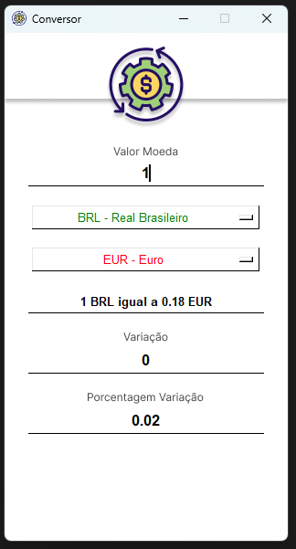
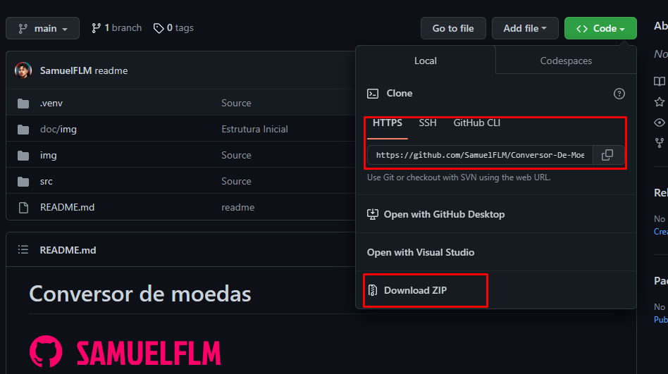
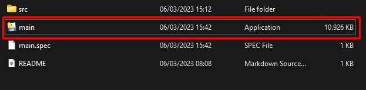

# Conversor de moedas

<!---Esses são exemplos. Veja https:/shields.io para outras pessoas ou para personalizar este conjunto de escudos. Você pode querer incluir dependências, status do projeto e informações de licença aqui--->
# Nao e necessario ter o python na maquina ou qualquer libs utilizada no projeto.

> So baixar o zip e utilizar.

> Um sistema/bot que vai melhorar sua facilidade para realizar qualquer consulta referente a conversao de moedas. 
> Projeto foi pensando e desenvolvido com o proposito de praticar e aplicar conceitos tecnicos de programacao.  Sem Fins lucrativos ou algo para prejudicar a marca.

### Como baixar o sistema.

> Pode baixar utilizando git clone ou download via zip....

> Apos download e so dar dois clicks no main... E pronto :D

